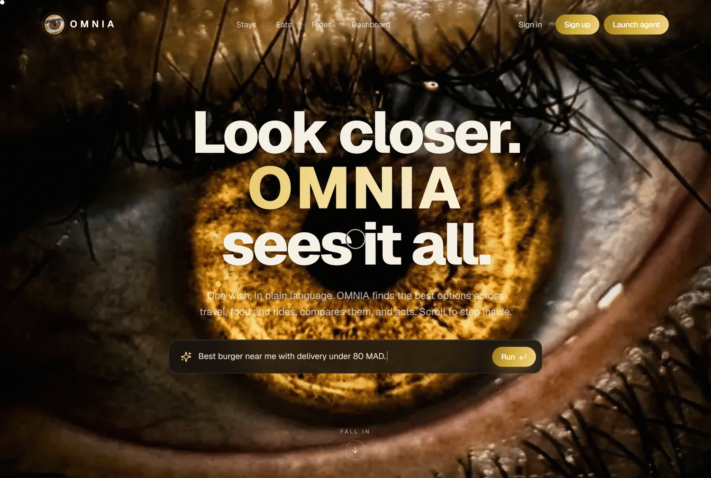
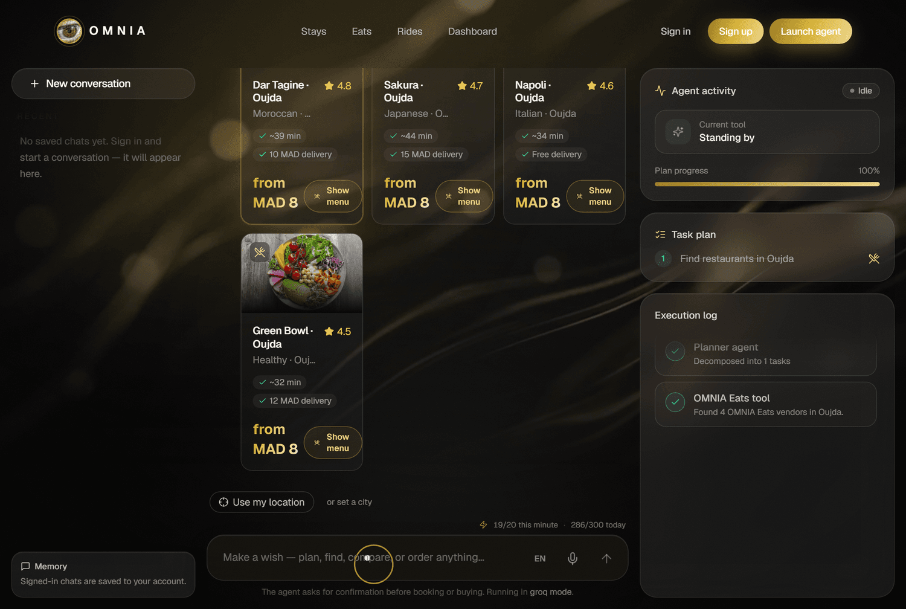
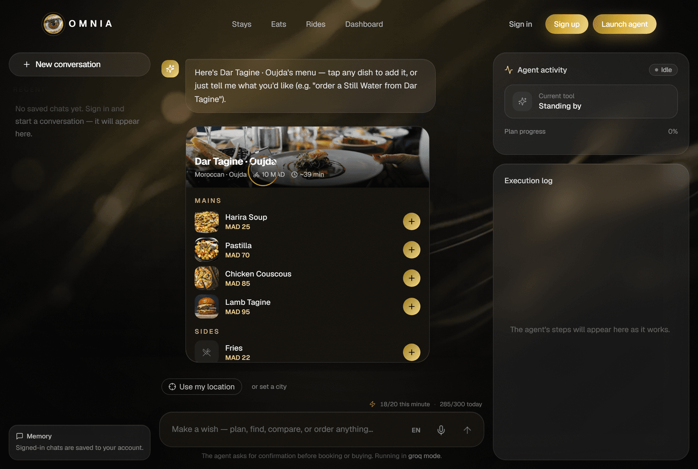
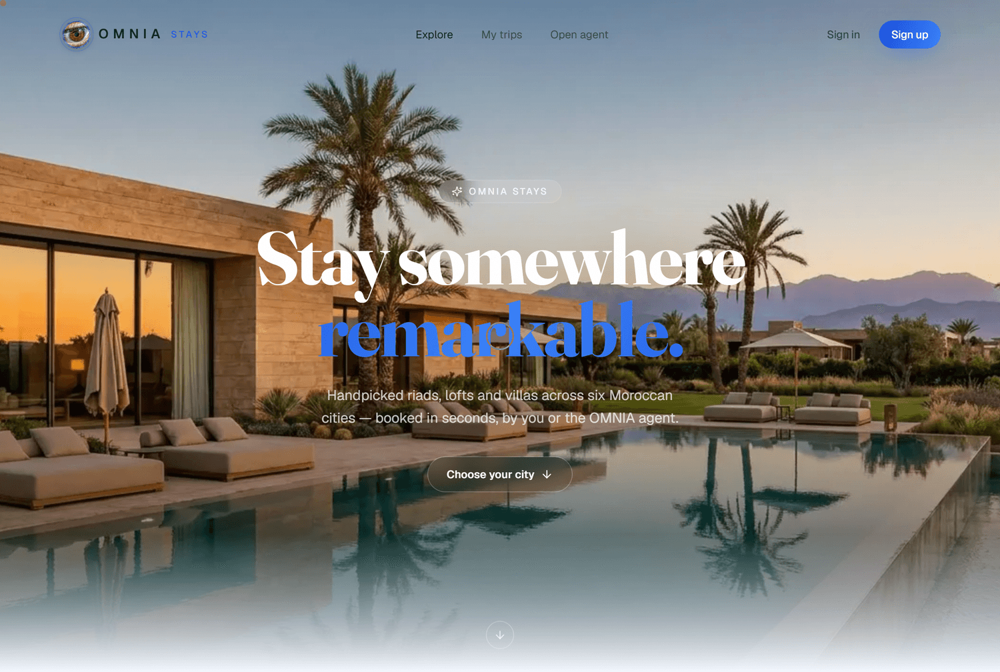
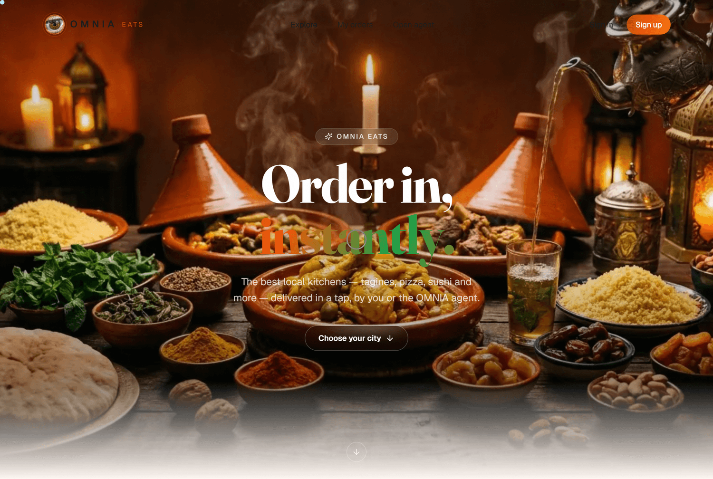
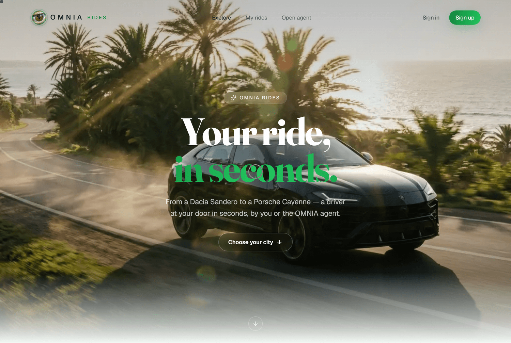

<div align="center">


<br/>

**An agentic AI concierge — and three connected marketplaces — for stays, dining, rides & travel across Morocco.**

<br/>

[](https://omnia-vert.vercel.app)
&nbsp;
[](#)

<br/>


</div>

---

OMNIA inverts the usual "super-app" of forms. You don't search — you make a wish. Describe what you want in plain language —
_"plan my weekend in Marrakech for two: a stay, dinner and an airport ride, under 3,000 MAD"_ — and the agent decomposes it,
compares real options across three **genuinely separate** marketplaces, respects your budget, and assembles a confirm-ready plan.

> Designed, built, deployed & documented end-to-end (product, frontend, backend, AI, infra) by **El Asmi Ilyas Daoud**.

## 🌐 Live

| Surface | URL |
|--------|-----|
| 🪄 **OMNIA Agent** | **https://omnia-vert.vercel.app** |
| 🏠 OMNIA Stays | https://omnia-stays.vercel.app |
| 🍽️ OMNIA Eats | https://omnia-eats.vercel.app |
| 🚗 OMNIA Rides | https://omnia-rides.vercel.app |

## 📸 A look inside

<table>
  <tr>
    <td width="50%"></td>
    <td width="50%"></td>
  </tr>
  <tr>
    <td align="center"><em>The cinematic “eye-portal” hero — state a wish.</em></td>
    <td align="center"><em>Restaurant suggestions, with the agent’s live plan &amp; execution log.</em></td>
  </tr>
  <tr>
    <td width="50%"></td>
    <td width="50%"></td>
  </tr>
  <tr>
    <td align="center"><em>The in-chat menu cart — add several dishes, then review one order.</em></td>
    <td align="center"><em>OMNIA Stays — handpicked riads, lofts &amp; villas.</em></td>
  </tr>
  <tr>
    <td width="50%"></td>
    <td width="50%"></td>
  </tr>
  <tr>
    <td align="center"><em>OMNIA Eats — full menus, live delivery info.</em></td>
    <td align="center"><em>OMNIA Rides — six tiers, live distance-based fares.</em></td>
  </tr>
</table>

## 🧩 The four apps

| App | What it is | Theme | Frontend | Backend |
|-----|-----------|-------|----------|---------|
| 🪄 **OMNIA Agent** | AI concierge — chat + live agent activity | Gold / black | `ai-agent-hub/` (5180) | `ai-agent-hub/backend/` (3000) |
| 🏠 **OMNIA Stays** | Airbnb-style stays marketplace | Blue | `omnia-stays/frontend/` (5181) | `omnia-stays/backend/` (3001) |
| 🍽️ **OMNIA Eats** | Food-delivery marketplace | Orange | `omnia-eats/frontend/` (5182) | `omnia-eats/backend/` (3002) |
| 🚗 **OMNIA Rides** | Ride-hailing marketplace | Green | `omnia-rides/frontend/` (5183) | `omnia-rides/backend/` (3003) |

Plus **`omnia-e2e/`** — a Playwright end-to-end suite covering all four apps.

It serves six Moroccan cities: **Rabat, Casablanca, Marrakech, Tanger, Oujda, Agadir**. Currency is MAD.

## 🤖 What the agent can do

- **Natural-language ordering & booking** — _"order a Margherita and a Coca-Cola from Napoli in Rabat"_ → a confirm-ready receipt that creates a real order (tagged _via OMNIA Agent_).
- **Full-trip planning across all three marketplaces** — stay + ride + meals assembled into one itinerary, with a hard budget cap.
- **A live menu cart** — suggested restaurants open their real menu in-chat; add several dishes with quantity steppers, then review one combined order.
- **Manage existing orders** — cancel, modify nights/guests, change a ride's pickup, edit order items, reorder "your usual".
- **Recurring tasks** — _"order my usual from Dar Tagine every Friday at 7pm"_; a cron fires it while you're away.
- **Memory & context** — remembers the conversation; follow-ups like _"just a water please"_ keep the active restaurant.
- **Scope guardrails** — politely declines off-topic requests and unsupported cities.
- **Reviews, an OMNIA Rewards wallet, live ride tracking, maps, and a per-user request meter.**

## 🏗️ Architecture

<div align="center">
  
</div>

```
        ┌──────────────────────── shared Clerk identity ────────────────────────┐
        │                                                                        │
  OMNIA Agent ──HTTP──▶ OMNIA Stays / Eats / Rides marketplaces (each its own DB)
  (chat + planner)        book / order / ride  →  real rows, "via OMNIA Agent" badge
        │
   Groq (Llama 3.3 70B) with multi-key failover
```

- **Frontend:** React 19 + Vite + TypeScript + TailwindCSS + Framer Motion + Zustand + React Query.
- **Backend:** NestJS + Prisma + PostgreSQL (Neon), one database per app.
- **AI:** Groq (Llama 3.3 70B) via a provider-agnostic layer, with automatic multi-key rotation and transient-failure retries.
- **Auth:** Clerk (shared across all four apps) with Google sign-in.
- **Realtime:** the agent streams its plan, steps, tokens and checkout drafts over **Server-Sent Events**.
- **Infra:** front-ends on **Vercel**, the four Dockerised backends on **Hugging Face Spaces**, databases on **Neon** — auto-deployed from this repo via **GitHub Actions**. The whole production stack runs on a **$0 budget**.

> The agent is a **hybrid**: the LLM _plans and phrases_, but a large deterministic engine resolves every real order — so it never hallucinates a price, a place, or a booking.

See [`OMNIA_OVERVIEW.md`](./OMNIA_OVERVIEW.md) for the full architecture, run guide, and security checklist.

## ⚙️ Run it locally

Each app needs its own `.env` (copy from the `.env.example` in each backend/frontend and fill in your own keys — Neon database URLs, Clerk keys, and a Groq API key).

```bash
# 1. Install deps (per app)
npm --prefix ai-agent-hub install && npm --prefix ai-agent-hub/backend install
#   …repeat for omnia-stays, omnia-eats, omnia-rides (frontend + backend)

# 2. Push the Prisma schema + seed each backend's database
npm --prefix ai-agent-hub/backend run prisma:push

# 3. Build + start the backends under PM2
npm --prefix ai-agent-hub/backend run build   # repeat per backend
pm2 start ecosystem.config.cjs

# 4. Start the frontends (Vite dev), ports 5180–5183
npm --prefix ai-agent-hub run dev
```

## 🔐 Security

- All real secrets live in per-app `.env` files, which are **gitignored** — only `.env.example` templates are committed.
- Per-user (or per-IP) rate limiting on the agent endpoint: 20/min + a daily cap persisted in Postgres (survives free-host restarts).
- Helmet headers, exact CORS allow-lists, per-user request keying by Clerk `sub`, and strict input validation at every API boundary.

## 👤 Creator

Built with ♥ in Morocco by **El Asmi Ilyas Daoud** — full-stack engineer · AI agents · product design.

[](https://www.linkedin.com/in/ilyas-daoud-el-asmi-0a531039b)
[](https://github.com/ilyasdaoudrma)
[](https://instagram.com/ig_yas10)
